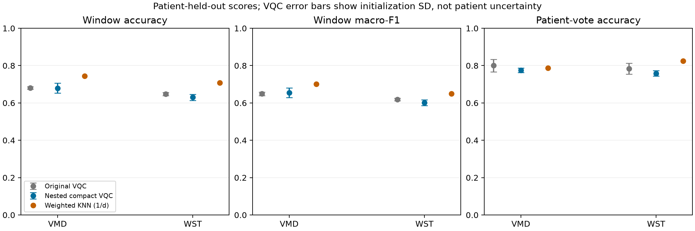
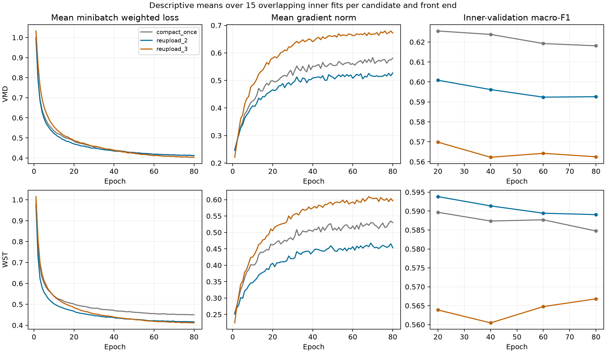

**Conclusion: this experiment did not establish a better VQC.** The complete nested
procedure left VMD window accuracy essentially unchanged (67.98% → 67.94%) and
lowered WST's observed accuracy (64.79% → 63.05%). VMD's primary macro-F1 increased
slightly, from 0.6489 to 0.6552; WST's fell from 0.6192 to 0.6011. Both paired
macro-F1 intervals include zero change. Keep the original VQCs as reference models;
this result does not justify promoting the new family as an accuracy improvement.

The practical lesson is to validate changes rather than assume that more encoding,
measurements, layers, or epochs will help. This run tested those ideas with a fixed
search procedure and retained the negative results. It used the existing dataset.



<!-- measured-results:start -->

**Completed nested experiment.** All 90 inner and 30 outer fits finished. The parallel fit phase took 29.0 minutes, excluding preparation and reporting. Every planned candidate was retained. No outer score was used to choose an architecture or epoch.

**Observed results.** VQC values are means ± sample standard deviation across three initialization seeds. The deterministic KNN control has one score. Accuracy variability is expressed in percentage points. Seed spread is not a confidence interval for unseen patients.

| Front end | Classifier | Window accuracy | Macro-F1 | Patient accuracy | Patient macro-F1 |
|---|---|---|---|---|---|
| VMD | Original VQC | 67.98% ± 0.70 | 0.6489 ± 0.0089 | 80.00% ± 3.31 | 0.7791 ± 0.0361 |
| VMD | Nested compact VQC | 67.94% ± 2.68 | 0.6552 ± 0.0259 | 77.50% ± 1.25 | 0.7606 ± 0.0053 |
| VMD | Weighted KNN (1/d) | 74.38% | 0.7008 | 78.75% | 0.7415 |
| WST | Original VQC | 64.79% ± 0.94 | 0.6192 ± 0.0068 | 78.33% ± 2.89 | 0.7627 ± 0.0301 |
| WST | Nested compact VQC | 63.05% ± 1.64 | 0.6011 ± 0.0156 | 75.83% ± 1.44 | 0.7286 ± 0.0122 |
| WST | Weighted KNN (1/d) | 70.86% | 0.6494 | 82.50% | 0.7888 |

**Per-seed outer results.**

| arm | seed | accuracy | balanced_accuracy | macro_f1 | patient_accuracy | patient_macro_f1 |
|---|---|---|---|---|---|---|
| vmd | 0 | 0.6574 | 0.677 | 0.6344 | 0.775 | 0.7594 |
| vmd | 1 | 0.7093 | 0.7231 | 0.6841 | 0.7875 | 0.7664 |
| vmd | 2 | 0.6716 | 0.6879 | 0.6471 | 0.7625 | 0.7559 |
| wst | 0 | 0.6475 | 0.6521 | 0.6175 | 0.75 | 0.7269 |
| wst | 1 | 0.629 | 0.6331 | 0.5994 | 0.775 | 0.7415 |
| wst | 2 | 0.6148 | 0.6235 | 0.5864 | 0.75 | 0.7173 |

**Training-fit diagnostic.** These are unweighted means across the 15 outer-training models per front end; they are not held-out scores. The full table also records each fit's selected epoch, first/final loss, and final gradient norm.

| arm | accuracy | macro_f1 | first_loss | final_loss | final_gradient_norm |
|---|---|---|---|---|---|
| vmd | 0.7852 | 0.7679 | 0.9485 | 0.503 | 0.5311 |
| wst | 0.7523 | 0.7365 | 0.9607 | 0.5452 | 0.4768 |

**Settings selected using inner patients only.** The last two columns are pooled inner-validation scores, not outer performance estimates.

| arm | outer_fold | candidate | epochs | macro_f1 | accuracy |
|---|---|---|---|---|---|
| vmd | 0 | reupload_2 | 20 | 0.5982 | 0.6211 |
| vmd | 1 | compact_once | 60 | 0.6311 | 0.6662 |
| vmd | 2 | compact_once | 40 | 0.6725 | 0.6977 |
| vmd | 3 | compact_once | 20 | 0.6371 | 0.6708 |
| vmd | 4 | compact_once | 40 | 0.63 | 0.6685 |
| wst | 0 | reupload_3 | 80 | 0.5633 | 0.607 |
| wst | 1 | compact_once | 20 | 0.6051 | 0.6362 |
| wst | 2 | reupload_2 | 20 | 0.6461 | 0.6877 |
| wst | 3 | compact_once | 20 | 0.6598 | 0.6815 |
| wst | 4 | reupload_2 | 40 | 0.5784 | 0.6246 |

**Paired patient-bootstrap changes.** Positive values favor the new VQC. These 5,000 paired resamples condition on saved predictions; they do not include retraining or repeating hyperparameter selection. Intervals crossing zero leave the direction uncertain and do not establish equivalence.

| Front end | Control | Metric | New minus control | Paired 95% interval |
|---|---|---|---|---|
| VMD | original_vqc | window_accuracy | -0.04 pp | [-2.53, +2.52] pp |
| VMD | original_vqc | window_macro_f1 | +0.0063 | [-0.0178, +0.0327] |
| VMD | original_vqc | patient_accuracy | -2.50 pp | [-7.92, +2.50] pp |
| VMD | original_vqc | patient_macro_f1 | -0.0186 | [-0.0757, +0.0397] |
| VMD | weighted_knn | window_accuracy | -6.44 pp | [-10.52, -2.28] pp |
| VMD | weighted_knn | window_macro_f1 | -0.0456 | [-0.0877, -0.0029] |
| VMD | weighted_knn | patient_accuracy | -1.25 pp | [-10.00, +7.50] pp |
| VMD | weighted_knn | patient_macro_f1 | +0.0191 | [-0.0803, +0.1247] |
| WST | original_vqc | window_accuracy | -1.75 pp | [-4.30, +0.73] pp |
| WST | original_vqc | window_macro_f1 | -0.0181 | [-0.0417, +0.0052] |
| WST | original_vqc | patient_accuracy | -2.50 pp | [-8.33, +3.33] pp |
| WST | original_vqc | patient_macro_f1 | -0.0342 | [-0.0971, +0.0272] |
| WST | weighted_knn | window_accuracy | -7.82 pp | [-11.52, -4.00] pp |
| WST | weighted_knn | window_macro_f1 | -0.0483 | [-0.0831, -0.0149] |
| WST | weighted_knn | patient_accuracy | -6.67 pp | [-14.17, +0.42] pp |
| WST | weighted_knn | patient_macro_f1 | -0.0603 | [-0.1331, +0.0124] |

**Matched front-end comparison with nested classifier tuning.** Both front ends received the same candidate family and search budget, with settings chosen separately. Positive values favor WST. These differences describe the full tuned pipelines.

| Metric | WST minus VMD | Paired 95% interval |
|---|---|---|
| window_accuracy | -4.90 pp | [-10.73, +1.26] pp |
| window_macro_f1 | -0.0541 | [-0.1121, +0.0042] |
| patient_accuracy | -1.67 pp | [-11.25, +8.33] pp |
| patient_macro_f1 | -0.0320 | [-0.1364, +0.0705] |

**Verification.** 90 inner models, 360 early checkpoints, and 30 outer models passed the saved-artifact checks. This includes patient boundaries, scaler training means, numerical finiteness, selected epoch counts, checkpoint/saved-model prediction spot checks, and exact outer prediction coverage.

All pooled candidate/epoch scores, selections, per-class metrics, confusion matrices, the complete trial ledger, and paired intervals are preserved in [the tracked tables](vqc_improvement_tables/). Epoch-level histories, checkpoint weights, fitted pipelines, and predictions remain in `results/vqc_improvement/`.

<!-- measured-results:end -->

**What the measured changes mean.**

- VMD's accuracy change is −0.04 percentage points, with a paired patient-bootstrap
  95% interval of [−2.53, +2.52]. Its macro-F1 change is +0.0063
  [−0.0178, +0.0327]. There is no convincing improvement over the original model.
- WST's accuracy change is −1.75 percentage points [−4.30, +0.73], and its
  macro-F1 change is −0.0181 [−0.0417, +0.0052]. These point estimates are worse;
  the intervals do not establish a consistent difference in either direction.
- Patient-vote accuracy also declined in the observed means: VMD 80.00% → 77.50%,
  WST 78.33% → 75.83%. Their paired intervals also cross zero.
- Training accuracy increased only modestly: VMD 77.72% → 78.52%, WST
  74.22% → 75.23%. Thus this change did not solve the limited training fit, and
  the small training gains did not translate into better held-out accuracy.
- Initialization mattered more for the new VMD model: its accuracy SD increased
  from 0.70 to 2.68 percentage points. Its best seed reached 70.93%, but quoting
  that seed alone would misrepresent the three-seed result.
- The VMD model redistributed errors: mean window CHF sensitivity rose from
  62.89% to 69.44%, while ARR sensitivity fell from 67.71% to 65.10%. This helps
  explain its slight macro-F1 gain with flat overall accuracy. These descriptive
  per-class changes are not evidence of a clinical improvement.
- Fixed weighted KNN retained higher observed window accuracy and macro-F1 for
  both front ends. Its macro-F1 advantage over the new VQC was 0.0456 for VMD
  and 0.0483 for WST; the conditional paired intervals exclude zero. KNN did not
  dominate every metric: its VMD CHF sensitivity was 57.33%, and its patient
  macro-F1 was below the new VMD VQC's. All metrics are recorded, not only accuracy.
- The tuned VMD pipeline scored above tuned WST in this run, but their paired
  accuracy and macro-F1 intervals still cross zero. This does not establish
  transform superiority, nor does it indicate a new WST implementation error.

The intervals are descriptive and have no adjustment for the multiple reported
comparisons. They condition on these fitted predictions. Both the original VQC
and KNN are fixed saved controls; the new procedure received nested tuning, so this
is not an isolated causal test of circuit architecture or a matched tuning-budget
contest against KNN.



**Next research decision, not a measured result.** Keep the original 12-qubit
architecture as a reference and test its optimizer and regularization separately:
select learning rate, weight decay, and stopping epoch within training-patient
folds, retaining all initialization seeds. A regularized classical model on the
same 12 angles would provide another useful check on how much of the remaining
gap is specific to the VQC. No claim is made that either next experiment will
succeed. Further claims need a locked evaluation protocol and, ultimately, an
independent cohort; repeatedly choosing changes from these outer scores would
make those scores increasingly optimistic. These follow-up experiments were not
run or counted among the 120 fits documented here.

The fixed scientific design is in [the declared protocol](vqc_improvement_protocol.md).
The code is `ecgvmd/reupload.py`; the resumable experiment is `scripts/improve_vqc.py`.
All model selection occurs in inner patient folds. The source dataset and previous
results remain unchanged.

**What changed, in plain language.** Give the circuit a different way to encode the
same 12 numbers, read more information from its output, and let validation patients
choose when training stops. Six qubits make this search affordable on a simulator;
fewer qubits are not assumed to improve accuracy by themselves. Repeated encoding
is a candidate to test, not a required ingredient or a promised improvement.

**Starting evidence.** The original VQC achieved mean window accuracy / macro-F1
of 67.98% / 0.6489 on VMD features and 64.79% / 0.6192 on WST features. Training
accuracy averaged 77.72% and 74.22%, respectively. Fixed inverse-distance KNN on
the same selected/scaled inputs reached 74.38% / 0.7008 and 70.86% / 0.6494.
Those observations motivated this follow-up; they do not identify one proven cause
of the original deficit. In particular, the previous evidence did not show that
feature compression alone was responsible.

**Engineering record before ECG scoring.**

- Implemented a separate six-qubit classifier. Original VQC code and weights were
  retained. All 12 selected input features enter the new circuit.
- Declared three candidate architectures and four candidate training durations,
  with identical search budgets for the two front ends.
- Retained a linear head, with no raw-feature bypass or classical hidden layer.
- Benchmarked the adjoint simulator on synthetic 96-row inputs: approximately
  0.22–0.33 seconds per minibatch step in these short runs.
- Compared adjoint and backpropagation backends on identical synthetic inputs.
  Total six-step fit times were 2.21 s and 0.29 s, including initialization; learned
  weights agreed to 1e-9. Selected backpropagation for execution efficiency.
- All 13 regression tests passed before launch. New tests checked circuit values
  against the adjoint backend, derivatives against finite differences, batched and
  individual inference, saved-model reloads, saved early checkpoints, unchanged
  training when validation logging is enabled, learning-rate prefix consistency,
  nested patient separation, and the declared selection tie break.
- All real-data nested preprocessing was fitted on its own training partition.
  Prepared and hashed the immutable run manifest before launching fits.

The exploratory synthetic fits are engineering checks, not ECG classification
results. A dependency emitted a NumPy 2.5/joblib deprecation warning during a reload
test; that test passed. No scientific trial has been dropped for a poor score.

**What inner validation selected.** All 90 inner fits completed without a failed
trial. VMD chose `compact_once` in four outer folds and `reupload_2` in one. WST
chose `compact_once` twice, `reupload_2` twice, and `reupload_3` once. Five of the ten
choices used 20 epochs, three used 40, one used 60, and one used 80. Thus the
validation data did not support applying more layers, repeated encoding, or longer
training uniformly. These are model-selection results; the outer scores assess
whether the selected procedure generalizes.

**Artifact locations.** `results/vqc_improvement/` contains:

| Artifact | What it records |
|---|---|
| `manifest.json`, `declared_protocol.md` | Input/code/protocol hashes, versions, candidate set, budget |
| `environment.json`, `source_snapshot/` | Python/dependency versions, machine/thread settings, base commit, and source copies |
| `nested_splits.csv` | Training, inner-validation, and outer-test row/patient assignments |
| `preprocessing/` | Fitted selectors/scalers, selected names, transformed inputs and row indices |
| `inner/*_history.csv` | Every epoch's loss, learning rate, gradient norm, elapsed time, checkpoint scores |
| `inner/*_checkpoints.npz` | Weights at epochs 20/40/60/80 |
| `inner/*_predictions.npz` | Inner-validation predictions for every candidate epoch |
| `inner/*.joblib`, `inner/*_weights.npz` | Final inner models and plain circuit/head arrays |
| `trial_ledger.csv`, `inner/*.json`, `outer/*.json` | Completed trials, timestamps, settings and runtimes; failure sidecars if any |
| `inner_scores.csv` | All pooled inner candidate/epoch scores, including non-winners |
| `selected.csv`, `selection.json` | Choice for each front end and outer fold |
| `outer/` | Selected fits, full pipelines, weights, histories, training and test predictions |
| `metrics.csv`, `summary.csv`, `predictions.npz` | Complete outer out-of-fold results after completion |
| `run.log`, `started.json`, `completed.json` | Execution log and run status |

The reporting scripts also export a combined epoch-history table, every window's
predictions, per-fold metrics, complete split assignments, and a SHA-256 artifact
inventory to `architects/vqc_improvement_tables/`. Figures in
`architects/vqc_improvement_figures/` show all candidate learning curves and the
final comparisons. The initial source snapshot is preserved; final reporting code
is stored separately in `results/vqc_improvement/reporting_source/`.

The generated directory is gitignored. Key result tables, all 8,280 epoch records,
split assignments, predictions, figures, and conclusions are also included in the
research documentation files intended for version control. No training trial failed.

**Reproduction.** From the repository root, with the previously prepared baseline
feature archive present:

```bash
OMP_NUM_THREADS=1 OPENBLAS_NUM_THREADS=1 MPLCONFIGDIR=/tmp/ecg-mpl-cache JOBLIB_TEMP_FOLDER=/tmp/ecg-joblib python scripts/improve_vqc.py --n-jobs 10
OMP_NUM_THREADS=1 OPENBLAS_NUM_THREADS=1 MPLCONFIGDIR=/tmp/ecg-mpl-cache python scripts/report_vqc_improvement.py
OMP_NUM_THREADS=1 OPENBLAS_NUM_THREADS=1 MPLCONFIGDIR=/tmp/ecg-mpl-cache python scripts/archive_vqc_improvement.py
```

Re-running resumes completed fits only when the content-hashed manifest agrees.
A changed experiment requires another output directory. The protocol was kept fixed
throughout this run; interpretation and final results are recorded in this document.

For inference with a saved fold model, load its complete preprocessing/classifier
pipeline. Pass the full feature array in the original column order (224 VMD columns
or 882 WST columns), not an independently selected or rescaled 12-column array:

```python
import joblib
import numpy as np

model = joblib.load("results/vqc_improvement/outer/vmd_o0_seed0.joblib")
with np.load("results/patient_vmd_wst_vqc/features.npz", allow_pickle=False) as data:
    held_out = data["fold"] == 0
    predictions = model.predict(data["vmd"][held_out])
```

Use the corresponding `wst_o0_seed0.joblib` with `data["wst"]` for WST. These are
cross-validation models, each trained without its designated test patients. The
experiment does not nominate the best outer-test fold or seed as a deployment
model. A single model trained on all patients would need a separately documented
training and external-evaluation plan. Plain weight files alone do not include the
feature selector or scaler.

**How to interpret this study.** The primary outcome is window macro-F1. Accuracy
and patient voting answer related but different questions. Seeds measure sensitivity
to initialization; they are not additional independent patients. Patient-bootstrap
intervals describe uncertainty conditional on the saved predictions and do not
repeat model training or candidate selection. Inner folds overlap across outer
folds, so averages of their learning curves are descriptive, not independent trials.
The logged loss is a mean of minibatch weighted losses during parameter updates,
not a final full-training-set objective evaluated at one fixed parameter vector.
The gradient norm combines circuit and head gradients; a nonzero total does not
rule out small circuit gradients. `training_fit.csv` also records each circuit's
weight displacement from initialization. These diagnostics are not a formal test
for or against a barren plateau.

Several ingredients changed relative to the original VQC: encoding, measurements,
parameter allocation, learning rate, schedule, and validation-based model selection.
Any improvement is evidence for the complete procedure, not proof that a particular
quantum ingredient caused it. The two-block compact and repeated-encoding candidates
have the same parameter count, but their inner scores are used for selection and
are not an independent significance test. This small simulator experiment does not
measure performance on quantum hardware or establish quantum advantage.

The cohort has already informed earlier experiments. This is a documented follow-up
on the same 80 patients, with patient-separated nested tuning, rather than external
validation. Class and source-database differences also remain confounded. The SPAR
paper's reported 94% validation accuracy is not a directly matched benchmark: its
complete patient-split and feature protocol has not been verified here. No new ECG
dataset was downloaded or introduced for this experiment.

**Earlier evidence and corrections.**

- [WST numerical audit and paper comparison](scattering_audit_2026-09-21.md)
- [Verified patient identities and original matched VQC run](patient_vmd_wst_vqc.md)
- [Weighted-KNN controls and VQC training-fit diagnostic](vqc_vs_spar_knn.md)
