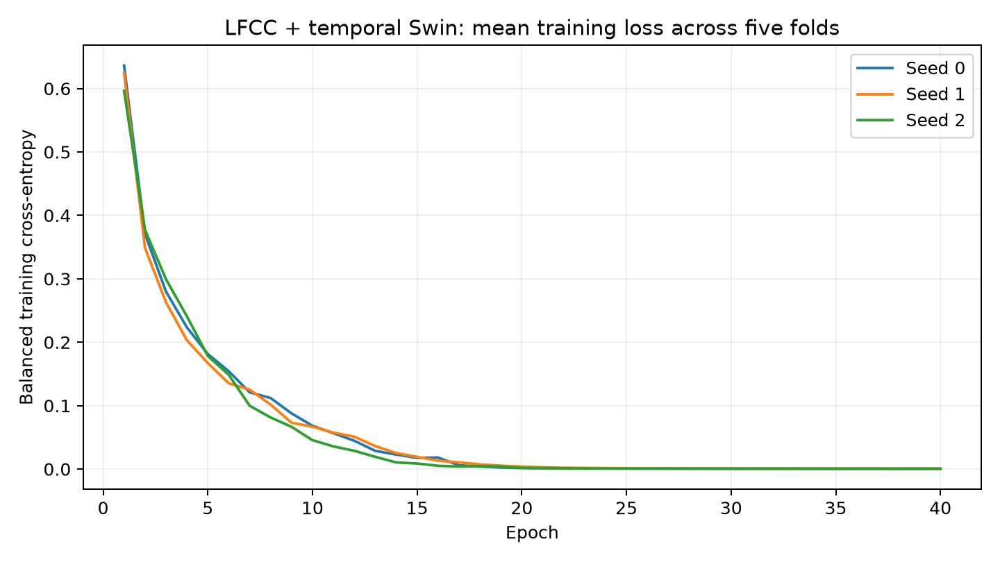

# ECGData LFCC + temporal Swin results — 2026-09-29 EDT

**Completed:** all 15 Swin fits and five logistic controls, with no failed real-data
trials or logistic convergence warnings. The unchanged protocol was trained on
the NVIDIA GeForce RTX 5070 using PyTorch 2.7.1+cu128. The training routine took
407.645 seconds (6 minutes 48 seconds), excluding dependency setup, synthetic
checks and reporting. All 600 planned Swin epochs are saved.

## Main result

These are out-of-fold predictions for the same 1,620 windows and 80 patients as
the corrected VMD/WST reference. For stochastic models, each entry averages the
complete out-of-fold result across seeds 0, 1 and 2; it is not a seed ensemble.

| Pipeline | Window accuracy | Window macro-F1 (primary) | Patient-vote accuracy | Patient-vote macro-F1 |
|---|---:|---:|---:|---:|
| LFCC + temporal Swin | 83.35% | 0.8006 | 94.17% | 0.9269 |
| Pooled LFCC + logistic regression | 76.48% | 0.7342 | 87.50% | 0.8517 |
| Original VMD + VQC | 67.98% | 0.6489 | 80.00% | 0.7791 |
| Original WST + VQC | 64.79% | 0.6192 | 78.33% | 0.7627 |

The existing matched inverse-distance KNN controls on 12 selected angle inputs
have 74.38% window accuracy / 0.7008 macro-F1 for VMD and 70.86% / 0.6494 for WST;
patient-vote accuracies are 78.75% and 82.50%. These are earlier fixed diagnostic
results, not refits or newly tuned alternatives. See the
[KNN report](../../../architects/vqc_vs_spar_knn.md). The current paired bootstrap
compares the four arms above; no new KNN interval is claimed.

## Every Swin seed

| Seed | Window accuracy | Window macro-F1 | Patient-vote accuracy | Patient-vote macro-F1 |
|---|---:|---:|---:|---:|
| 0 | 81.98% | 0.7836 | 92.50% | 0.9066 |
| 1 | 84.75% | 0.8201 | 96.25% | 0.9586 |
| 2 | 83.33% | 0.7981 | 93.75% | 0.9156 |

Sample standard deviations across the three seeds: 1.39 percentage points for window accuracy and 0.0184 for window macro-F1. These measure initialization variability, not uncertainty from new patients.

## Patient-cluster uncertainty

The frozen procedure uses 2,000 paired patient bootstrap draws, seed 20260925,
with the same patient multiplicities in all arms and seeds; scores are averaged
across seeds within each draw. No single-class draw was rejected. Intervals are
conditional on the saved predictions and exclude retraining and model-selection
uncertainty. They are nominal 95% intervals without multiplicity adjustment.

| Swin metric | Observed mean | 95% interval |
|---|---:|---:|
| window_macro_f1 | 0.8006 | [0.7453, 0.8432] |
| window_accuracy | 83.35% | [79.33, 87.14]% |
| patient_vote_macro_f1 | 0.9269 | [0.8678, 0.9706] |
| patient_vote_accuracy | 94.17% | [89.58, 97.92]% |

| Swin minus comparator | Window macro-F1 difference | Paired 95% interval | Window accuracy difference | Paired 95% interval |
|---|---:|---:|---:|---:|
| Pooled LFCC + logistic regression | +0.0664 | [+0.0224, +0.1143] | +6.87 pp | [+2.75, +11.27] pp |
| Original VMD + VQC | +0.1517 | [+0.0899, +0.2090] | +15.37 pp | [+9.71, +20.54] pp |
| Original WST + VQC | +0.1814 | [+0.1138, +0.2532] | +18.56 pp | [+12.35, +25.06] pp |

The primary paired intervals are above zero for these saved predictions. This
supports an improvement of this LFCC + Swin pipeline within this experiment.
It does not isolate the contribution of LFCC, attention, temporal information,
model capacity or optimization: the complete pipelines differ. It does not
establish general superiority of Swin or cepstral features, VMD versus WST
superiority, quantum advantage, or clinical effectiveness.

## Data and fixed settings

No new records or windows were excluded. The existing verified cohort includes
162 lead rows, 81 recordings and 80 patients; MIT-BIH 201/202 remain one patient.
All leads and repeat recordings from a patient stay in one outer fold.

| Class | Windows | Patients |
|---|---:|---:|
| ARR | 960 | 47 |
| CHF | 300 | 15 |
| NSR | 360 | 18 |

| Test fold | Test windows | Test patients |
|---|---:|---:|
| 0 | 340 | 16 |
| 1 | 320 | 16 |
| 2 | 320 | 16 |
| 3 | 320 | 16 |
| 4 | 320 | 16 |

- Inputs: exact saved 500-sample, 128 Hz standardized windows; 10 per lead row,
  sampling seed 0. The existing cache and five outer patient folds were reused.
- LFCC: 128-sample periodic-Hann frames, hop 32, FFT 256, 32 linear bands from
  0–64 Hz, natural log floor 1e-12, orthonormal DCT-II, c0–c15. Each window is
  13 × 1 × 16; final frame uses 12 reflected samples. Cepstra are a fixed
  transform, not fitted weights. MFCC was not run.
- Swin: randomly initialized 1-D temporal adaptation, 33,607 parameters,
  widths 16/32, depths 2/2, heads 2/4, window 4 and shift 2, three outputs.
  This is not a pretrained image Swin or a paper replication.
- Fit-only coefficient normalization; AdamW, lr 0.001, weight decay 0.01,
  cosine decay toward 0.0001, 40 epochs, batch 32, gradient clip norm 1,
  cross-entropy weights computed from each training partition. Seeds 0/1/2;
  shuffle RNG uses seed + 10000 + zero-based epoch. No early stopping, tuning
  or model selection used the outer predictions.
- Control: temporal coefficient means/population standard deviations, training-only
  StandardScaler, balanced logistic regression, C=1, lbfgs, max_iter=2000,
  random_state=0. Five deterministic fits.
- Float32, deterministic PyTorch algorithms, TF32 disabled, no mixed precision,
  one CPU thread, CUBLAS_WORKSPACE_CONFIG=:4096:8. Logistic fitting used CPU.

Exact settings, source hashes and library versions are in the unchanged
[protocol](../../ecgdata_protocol.json) and saved run manifest. Window and fold
hashes remain `3eaffccfb4f7390ea677937bd233285d1a918f0810da527b3634566b952f9af9`
and `1d88466d8e2050de0f05fdf3f51b05bdbdd791da114f5e477ffeb472bcc650f5`.

## Training behavior and limitations

Every Swin model classified all of its own training windows correctly at the
final epoch. The mean held-out window accuracy was 83.35%, so a training versus
held-out gap remains. The learning curves show near-zero training loss; they
are not held-out learning curves and do not establish an optimal stopping epoch.
No additional epochs, architecture changes or retraining were selected from
these results. The control's mean in-fold training accuracy was 89.01%.

This cohort contains only 80 patients, has informed repeated research decisions,
and confounds diagnosis with source database. These are exploratory results,
not untouched external validation. Patient voting combines multiple windows
and leads and therefore measures a different prediction unit from window
accuracy. No published paper's accuracy is treated as directly comparable.



## Verification, runtime and failures

All 21 CPU tests passed. GPU forward and gradient checks against CPU had maximum
absolute errors of 1.49e-7 and 7.45e-8. On synthetic inputs, an interrupted
one-epoch checkpoint resumed to exactly the same two-epoch model weights and
predictions as uninterrupted fitting. Real-data training needed no recovery.

All 20 completed models were reloaded on CPU. Recomputed predictions had
identical classes; maximum probability difference from the saved CUDA results
was 1.85e-6. Checks covered all saved trial hashes, patient boundaries, exactly-once
out-of-fold coverage, fit-only normalization, class weights, all 40 epochs and
learning rates, finite parameters/losses, and histories matching checkpoints.
These checks provide engineering evidence, not proof of bug-free software.

Sum of fit runtimes: 402.389 seconds; Swin fits accounted for 402.211 seconds, and logistic fits for 0.177 seconds. Maximum PyTorch allocated CUDA memory was 71.88 MiB; this excludes driver/context and display memory. Individual runtimes are in [fits.csv](fits.csv).

There were zero real-data training failures and zero logistic warnings. Setup
had an initial sandbox DNS failure, resolved by an approved download outside
the sandbox. A forward-only invocation before loading the separate PyTorch
path failed with ModuleNotFoundError; the later complete test suite passed.
GPU checks require access outside the sandbox. The installer spent substantial
time copying dependencies to the Windows-mounted project directory; that time
is excluded from training runtime. CPU dependencies in the original environment
were not changed. Existing ACS extraction remains paused.

Before training, all 134 protected files and 930 prior VQC improvement artifacts
passed checksum verification. After training, the protected-file inventory was
checked again. See the [preflight](../ecgdata_preflight_integrity_2026-09-29.json)
and [postflight](../ecgdata_postflight_integrity_2026-09-29.json) records.

## Artifacts and reproduction

- [Full metrics, all seed/class confusions and bootstrap intervals](report.json).
- [Validation evidence](validation.json), [per-seed metric table](metrics.csv),
  [all new predictions and patient/fold assignments](predictions.csv),
  [600 epoch records](histories.csv), [fit runtimes and training scores](fits.csv).
- [Saved artifact checksum inventory](artifact_inventory.csv), paths relative to
  `attention method/results/ecgdata_lfcc_swin_v1/`.
- [Execution/environment record](../ecgdata_execution_20260930T014422Z.json),
  [GPU validation](../ecgdata_gpu_validation_2026-09-29.json),
  [training log](../ecgdata_gpu_training_2026-09-29.log),
  [test log](../ecgdata_tests_2026-09-29.log), [audit log](../ecgdata_audit_2026-09-29.log),
  [CUDA package pins](../torch_cu128_packages_2026-09-29.txt).
- Per-fold checkpoints retain the final model/optimizer/scheduler/RNG state and
  the complete epoch history. Each committed epoch replaces the preceding
  checkpoint; there are 15 final Swin checkpoints, not 600 separate weight files.
- Models, feature cache and dependencies are gitignored. Versioned reports do
  not back up those binaries. No further training is pending for this protocol.

From the repository root, reuse/report the completed run with:

```bash
export PYTHONPATH="$PWD/attention method/.venv/torch-cu128"
export OMP_NUM_THREADS=1 OPENBLAS_NUM_THREADS=1 CUBLAS_WORKSPACE_CONFIG=:4096:8
/home/jaydenlee/venvs/test-ecg-training/bin/python -B 'attention method/ecgdata.py' report
```

For a deliberate rerun of the verification and table export, run
`attention method/scripts/audit_ecgdata_run.py` with the same interpreter and
PYTHONPATH. It performs inference, not fitting. The explicit training command
in the [execution guide](../ecgdata_gpu_execution_2026-09-29.md) verifies/reuses
completed fits. Changed code, scientific settings or numerical versions require
a new documented run directory; do not overwrite this completed experiment.
