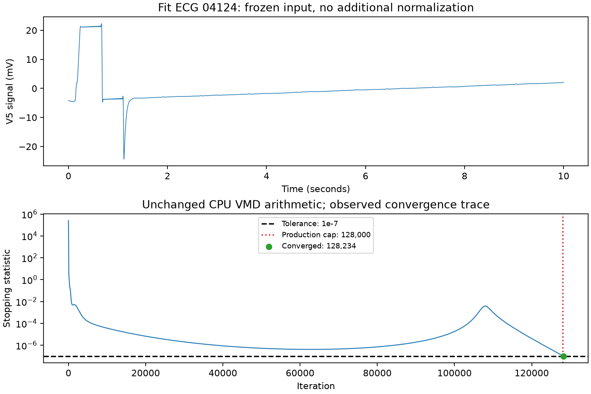

# ACS 04124/V5 convergence diagnosis — 2026-09-27 EDT

## Result

The frozen CPU and GPU solvers both converge at **128,234 iterations**, only 234
iterations beyond the failed production cap of 128,000. The stopping tolerance
remained **1e-7**. This particular production stop is explained by the bounded
iteration budget: the statistic was still above tolerance when the run stopped.

This is measured agreement on the failing fit lead, not proof that all code is
bug-free or that a larger bound will cover every remaining ECG. No ECG was excluded,
no input normalization was introduced, and no tolerance was relaxed.

| Check | Measured result |
|---|---|
| Frozen CPU reproduction at 128,000 | Capped; finite modes and centre frequencies; 69.045 seconds |
| Diagnostic-only CPU trace, bounded at 512,000 | Converged at 128,234; 69.783 seconds |
| Statistic at iteration 128,000 | 1.10915533364e-7, above tolerance |
| Statistic at iteration 128,234 | 9.99822321362e-8, below tolerance |
| Frozen GPU, separate 256,000-cap check | Converged at 128,234; 49.948 seconds |
| GPU–CPU maximum absolute mode difference | 5.7421e-13 |
| GPU–CPU maximum centre-frequency difference | 1.0569e-13 Hz |
| Saved production checkpoints | All 3,700 verified; imported feature bytes unchanged |

The stopping statistic is computed from squared mode updates and normalized by
spectrum length. It is not divided by input signal energy. Earlier documentation
calling it a relative update is imprecise. This diagnostic retained the exact
implemented arithmetic. The statistic was nonmonotonic during the long run; a
short interval of progress is not a reliable extrapolation of convergence time.

The source V5 waveform ranges from -24.360 to +22.304 mV (standard deviation
5.133568 mV) under the unchanged loader. These are recorded input statistics;
no new quality exclusion or causal claim about the large amplitude is made.

## How this was checked

`scripts/diagnose_04124.py` verifies the parent manifest, pinned numerical sources,
source archive identities, patient/record mapping and fit-partition membership.
It first reproduces the production cap with the unmodified `vmd_batch`, then calls
a diagnostic-only copy with an observation callback. The callback does not change
the updates or stopping rule. A synthetic test verifies exact mode, frequency,
iteration and capped-flag parity for both converged and capped cases, including
compaction of the active batch. All results and trace arrays are saved separately.

`scripts/verify_04124_gpu.py` checks the saved CPU artifacts and uses the unchanged
GPU solver at 256,000. The returned iteration count is identical; modes and centres
pass atol=1e-6, rtol=1e-5 with actual errors near floating-point precision.

Detailed evidence: `vmd_04124_diagnostic_2026-09-27.json`,
`results/vmd_04124_diagnostic_v1/`, and `results/vmd_04124_gpu_check_v1/`.
No model fitting or official-test processing occurred during these checks.

## Separate pre-existing scalar-reference issue

Inspection and a synthetic reproduction found an off-by-one count when the older
scalar `ecgvmd.vmd.vmd()` exhausts its loop: with `max_iter=2` and `tol=0`, it returns
one iteration and `capped=False`. The positive epsilon in its statistic means zero
tolerance cannot have been met. The production batched solver correctly returns
two iterations and `capped=True` for that check.

ACS extraction uses the batched CPU/GPU implementations, not this scalar routine.
This issue does not explain the ACS failure. The shared source was left unchanged
because existing experiments pin its hash. A separate shared-code revision should
fix the scalar count and add regression tests while preserving old run provenance.
Reproduction details: `scalar_reference_audit_2026-09-27.json`.

## Continuation

A separate protocol appends a **256,000** retry to the existing limits, leaving all
other scientific settings fixed. The new output is `results/omi_v1_gpu_retry256k/`.
Its preparation reuses the 3,700 verified checkpoints. The previous 128k run remains
frozen. Check the new run's status file for actual launch/completion state; this
diagnostic report is not a claim that full extraction has finished.
